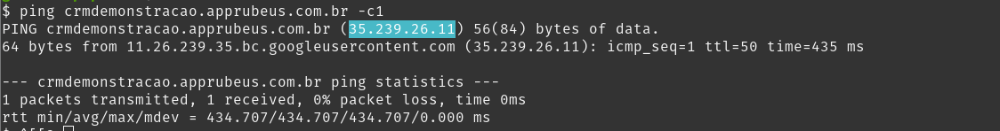

# rubeus-network-access

### Automações Rubeus

Para integração com qualquer aplicação Rubeus estes endereços deve estar liberados:

```shell
35.199.83.226
```

### Plataforma Rubeus

Para descobrir o endereço IP da Plataforma Rubeus basta executar o comando “ping” em modo de terminal e observar o endereço que responderá sua requisição, como na imagem abaixo:



Telefonia (Asterisk Rubeus)
 ```shell
 35.188.163.36
 ```
Prova Online 
```shell
34.95.151.137
```

Inscrições e Matrículas (Nova ficha)
```shell
34.95.151.137
```

Integrador TOTVS
```shell
34.67.233.17
```

Fila
```shell
35.208.129.44
```

CRM GKE
```shell
34.134.207.150
```
Call-totvs 
```shell
34.121.201.21
```